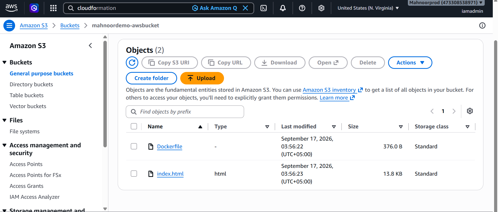
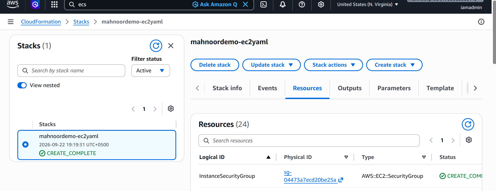
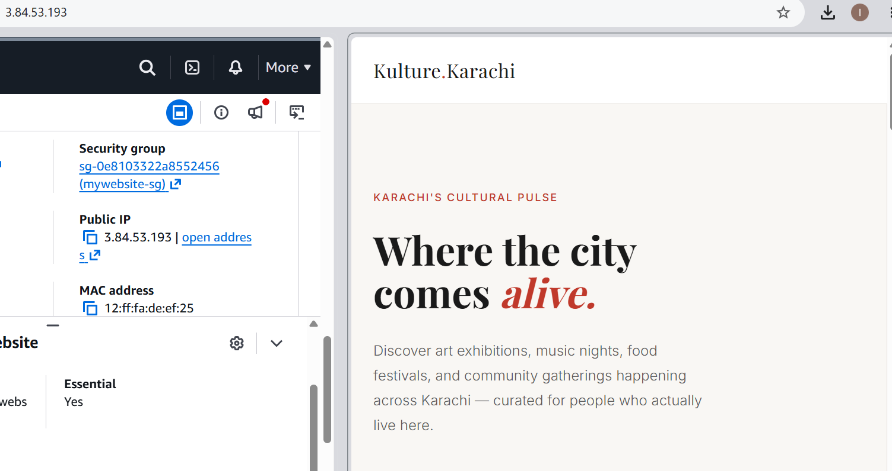
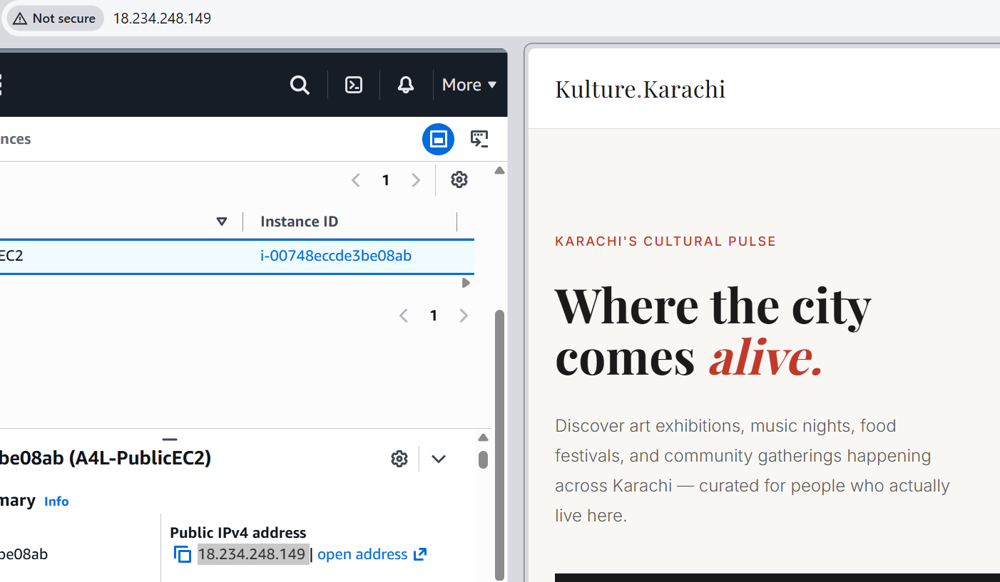

# 🌆 Kulture Karachi — AWS ECS Deployment Demo

A containerized demo of **Kulture Karachi**, a community events platform for Karachi.  
This project demonstrates a full AWS deployment pipeline using S3, CloudFormation, EC2, Docker, and ECS.

---

## 🏗️ Architecture Overview
S3 Bucket (index.html + Dockerfile)
↓
CloudFormation Stack (VPC, Subnets, EC2, IAM Roles)
↓
EC2 Instance (Docker installed via UserData)
↓
Docker Image built → Pushed to Docker Hub (mahnoorjawedd/mywebsite)
↓
ECS Cluster → Task Definition → Running Container
↓
Live via ECS Public IP on port 80

---

## 🗂️ Files in This Repo

| File | Description |
|------|-------------|
| `index.html` | The Kulture Karachi demo web page |
| `Dockerfile` | Docker config to containerize the site |
| `ec2docker_AL2023.yaml` | CloudFormation template — provisions VPC, EC2, IAM, Security Groups |
| `mahnoordemo-mywebsite-revision1.json` | ECS Task Definition (Fargate, 512 CPU / 1024MB, port 80) |

---

## ⚙️ Deployment Steps I Followed

1. **S3** — Uploaded `index.html` and `Dockerfile` to S3 bucket `mahnoordemo-awsbucket`
2. **CloudFormation** — Deployed `ec2docker_AL2023.yaml` to provision a full VPC with public subnets, an EC2 instance, and IAM roles with S3 access
3. **EC2** — The instance auto-pulled files from S3 via UserData script, installed Docker, and started the service
4. **Docker** — SSH'd into EC2, built the Docker image, and pushed it to Docker Hub as `mahnoorjawedd/mywebsite:latest`
5. **ECS** — Created a Fargate cluster, registered the task definition, and ran the task
6. **Live** — Accessed the running container via the ECS public IP on port 80 ✅

---

## 📸 Screenshots

### S3 Bucket

### CloudFormation Stack — Success

### Website via EC2 Public IP

### Website via ECS Cluster Public IP

---

## 🛠️ Tech Stack

| Service | Purpose |
|---------|---------|
| Amazon S3 | Static file storage |
| AWS CloudFormation | Infrastructure as Code |
| Amazon EC2 (Amazon Linux 2023) | Docker host |
| Docker Hub | Container image registry |
| Amazon ECS (Fargate) | Container orchestration |

---

## 🐳 Docker Hub

Image: [`mahnoorjawedd/mywebsite:latest`](https://hub.docker.com/r/mahnoorjawedd/mywebsite)

---

*Demo project — AWS resources have been cleaned up after completion.*
